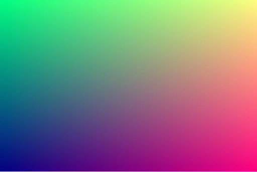

# gl-react-native

OpenGL bindings for react-native to implement complex effects over images and components, in the descriptive VDOM paradigm.

More technically, `gl-react-native` allows you to write a [fragment shader](https://www.opengl.org/wiki/Fragment_Shader) that covers a View. The shader can render: generated graphics/demos, effects on top of images, effects over any UI content... anything you can imagine!

**`gl-react-native` is directly inspired from [`gl-react`](http://github.com/ProjectSeptemberInc/gl-react) and implement the same API (so you can write "universal" code).**

[](./Examples/Simple)[](./Examples/AdvancedEffects)

### HelloGL Gist

```js
const React = require("react-native");
const GL = require("gl-react-native");

const shaders = GL.Shaders.create({
  helloGL: {
    frag: `
precision highp float;
varying vec2 uv;
void main () {
  gl_FragColor = vec4(uv.x, uv.y, 0.5, 1.0);
}`
  }
});

class HelloGL extends GL.Component {
  render () {
    const { width, height } = this.props;
    return <GL.View
      shader={shaders.helloGL}
      width={width}
      height={height}
    />;
  }
}
```



## Installation

a few steps are required to install `gl-react-native`:

**Install the dependency to your React Native application:**

```
npm i --save gl-react-native
```

**Configure your React Native Application:**


## Influence / Credits

- [stack.gl](http://stack.gl/) approach
- [GLSL.io](http://glsl.io/) and [Diaporama](https://github.com/gre/diaporama)
- Source code of [React Native](https://github.com/facebook/react-native)

## Documentation

[**Gitbook**](http://projectseptemberinc.gitbooks.io/gl-react/content/)
